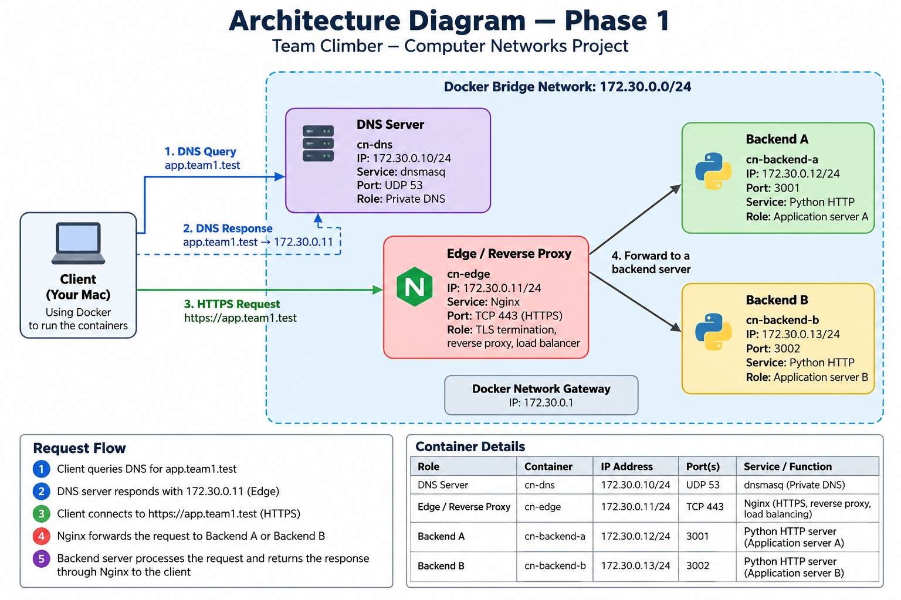

# CN Phase 1 --- Computer Networks Project

## Team Climber

A Phase 1 Computer Networks implementation demonstrating:

-   Private DNS using `dnsmasq`
-   HTTPS and TLS termination
-   Nginx reverse proxy
-   Load balancing across two application backends
-   TCP connection establishment
-   TLS 1.3 packet analysis with Wireshark
-   HTTP caching using `Cache-Control` and `ETag`
-   Backend failure recovery
-   End-to-end request flow from DNS to application response

> **Implementation note:** The official project architecture uses
> separate network roles. This implementation reproduces those logical
> roles as separate Docker containers running on a single macOS host.
> The IP addresses below are Docker bridge-network IPs, not separate
> physical Mac IPs.

------------------------------------------------------------------------

## 1. Project Overview

The goal of Phase 1 is to build and demonstrate a small distributed
web-service architecture covering the major networking layers involved
in a real application request.

The system uses:

1.  A private DNS server to resolve `app.team1.test`
2.  An Nginx edge server to terminate HTTPS
3.  Nginx as a reverse proxy and load balancer
4.  Two independent Python HTTP application servers
5.  Wireshark packet captures for DNS, TCP, and TLS
6.  HTTP caching and conditional revalidation
7.  A backend failure demonstration showing service continuity

The official Phase 1 deliverables require an architecture document,
configuration bundle, backend source code, evidence, and a working live
demonstration. This repository keeps the implementation and supporting
evidence together.

------------------------------------------------------------------------

## 2. Architecture



### Actual Implemented Architecture

``` text
                         YOUR macOS HOST
                     Docker Engine / Compose
                              |
                              |
              +---------------+----------------+
              | Docker Bridge Network           |
              | 172.30.0.0/24                  |
              |                                |
              |  +--------------------------+  |
              |  | DNS Server               |  |
              |  | cn-dns                   |  |
              |  | 172.30.0.10              |  |
              |  | dnsmasq / UDP 53         |  |
              |  +------------+-------------+  |
              |               |                |
              |               | DNS response  |
              |               | 172.30.0.11   |
              |               v                |
              |  +--------------------------+  |
              |  | Edge / Reverse Proxy     |  |
              |  | cn-edge                  |  |
              |  | 172.30.0.11             |  |
              |  | Nginx / TCP 443          |  |
              |  | TLS + Reverse Proxy      |  |
              |  | + Load Balancer           |  |
              |  +------------+-------------+  |
              |               |                |
              |          +----+----+           |
              |          |         |           |
              |          v         v           |
              |  +-----------+ +-----------+  |
              |  | Backend A | | Backend B |  |
              |  | cn-       | | cn-       |  |
              |  | backend-a | | backend-b |  |
              |  | .0.12     | | .0.13     |  |
              |  | :3001     | | :3002     |  |
              |  +-----------+ +-----------+  |
              |                                |
              +--------------------------------+

Client commands are executed from the Docker environment or the macOS host,
depending on the test. The service roles themselves are isolated in containers.
```

### Container / Service Table

  ------------------------------------------------------------------------------------
  Role       Container             IP Address           Port Service    Purpose
  ---------- ---------------- --------------- -------------- ---------- --------------
  DNS Server `cn-dns`           `172.30.0.10`         UDP 53 dnsmasq    Private DNS

  Edge /     `cn-edge`          `172.30.0.11`        TCP 443 Nginx      HTTPS, TLS
  Reverse                                                               termination,
  Proxy                                                                 reverse proxy,
                                                                        load balancing

  Backend A  `cn-backend-a`     `172.30.0.12`       TCP 3001 Python     Application
                                                             HTTP       server A
                                                             server     

  Backend B  `cn-backend-b`     `172.30.0.13`       TCP 3002 Python     Application
                                                             HTTP       server B
                                                             server     
  ------------------------------------------------------------------------------------

Docker network:

``` text
Network:  172.30.0.0/24
Gateway:  172.30.0.1
```

------------------------------------------------------------------------

## 3. End-to-End Request Flow

A normal request follows this path:

``` text
1. Client
      |
      | DNS query: app.team1.test
      | UDP 53
      v
2. cn-dns / dnsmasq
      |
      | app.team1.test -> 172.30.0.11
      v
3. cn-edge / Nginx
      |
      | HTTPS / TLS 443
      | TLS termination
      |
      | HTTP reverse-proxy request
      +----------------------+
      |                      |
      v                      v
4. Backend A             Backend B
   172.30.0.12:3001      172.30.0.13:3002
      |                      |
      +----------+-----------+
                 |
                 v
5. Nginx sends the response
   back to the client
```

### Protocol sequence

``` text
DNS
 ↓
UDP/53
 ↓
TCP connection to Edge
 ↓
TLS handshake
 ↓
HTTPS request
 ↓
Nginx reverse proxy
 ↓
Backend A / Backend B
 ↓
HTTP response
```

------------------------------------------------------------------------

# 4. Repository Structure

``` text
cn-phase1/
│
├── 01-architecture/
│   ├── topology-and-ip-inventory.md
│   └── request-flow.md
│
├── 02-config/
│   ├── backend-run.md
│   ├── dnsmasq.conf
│   ├── nginx.conf
│   └── tls-setup-notes.md
│
├── 03-code/
│   └── backend.py
│
├── 04-evidence/
│   ├── A-lan/
│   ├── B-dns/
│   ├── C-backends/
│   ├── D-loadbalance/
│   ├── E-tls/
│   ├── F-caching/
│   ├── G-capture/
│   │   ├── C1-dns.pcap
│   │   └── C2-C3-https.pcap
│   └── failures/
│       └── backend-a-failure-recovery.txt
│
├── backend/
│   └── backend.py
│
├── certs/
│   └── app.crt
│
├── dns/
│   ├── Dockerfile
│   └── dnsmasq.conf
│
├── edge/
│   └── nginx.conf
│
├── docker-compose.yml
├── README.md
└── .gitignore
```

`certs/app.key` is intentionally excluded from Git.

------------------------------------------------------------------------

# 5. Technologies Used

  Technology            Role
  --------------------- --------------------------------------------------
  Docker                Container isolation and networking
  Docker Compose        Multi-container orchestration
  dnsmasq               Private DNS
  Nginx                 HTTPS termination, reverse proxy, load balancing
  OpenSSL               Self-signed TLS certificate generation
  Python 3.12           Backend application servers
  curl                  HTTP/HTTPS testing
  dig                   DNS testing
  Wireshark / tcpdump   Packet analysis
  Git / GitHub          Source-code and project version control

------------------------------------------------------------------------

# 6. Docker Network

The containers communicate through a dedicated Docker bridge network:

``` text
172.30.0.0/24
```

Static container addresses are assigned as follows:

``` text
172.30.0.10   DNS
172.30.0.11   Nginx Edge
172.30.0.12   Backend A
172.30.0.13   Backend B
```

This makes the network topology deterministic and easy to inspect during
the demonstration.

------------------------------------------------------------------------

# 7. Private DNS

The DNS server uses `dnsmasq`.

### Configuration

``` conf
interface=eth0
listen-address=172.30.0.10
no-resolv
address=/app.team1.test/172.30.0.11
local-ttl=60
log-queries
log-facility=-
```

The important private DNS mapping is:

``` text
app.team1.test
        |
        v
172.30.0.11
        |
        v
Nginx Edge
```

### Test

``` bash
docker compose exec dns dig @172.30.0.10 app.team1.test
```

Expected result:

``` text
status: NOERROR
ANSWER: 1

app.team1.test. 60 IN A 172.30.0.11

SERVER: 172.30.0.10#53(172.30.0.10)
```

This demonstrates that the private DNS server resolves the application
hostname to the Nginx Edge container.

------------------------------------------------------------------------

# 8. Nginx Edge / Reverse Proxy

Nginx is the entry point for HTTPS traffic.

It performs three main jobs:

1.  Terminates TLS
2.  Acts as a reverse proxy
3.  Balances requests between Backend A and Backend B

### Upstream configuration

``` nginx
upstream app_backends {
    server 172.30.0.12:3001;
    server 172.30.0.13:3002;
}
```

The HTTPS server listens on:

``` text
TCP 443
```

The TLS certificate and private key are mounted into the Nginx
container.

Nginx forwards requests to:

``` text
Backend A → 172.30.0.12:3001
Backend B → 172.30.0.13:3002
```

------------------------------------------------------------------------

# 9. TLS / HTTPS

A self-signed certificate was generated for:

``` text
app.team1.test
```

The certificate contains:

``` text
CN = app.team1.test
SAN = DNS:app.team1.test
```

The configured TLS versions are:

``` nginx
ssl_protocols TLSv1.2 TLSv1.3;
```

The certificate is mounted into Nginx:

``` text
/certs/app.crt
/certs/app.key
```

### Nginx configuration test

``` bash
docker compose exec edge nginx -t
```

### HTTPS test

The certificate can be explicitly trusted for the test with:

``` bash
docker compose exec dns curl --cacert /certs/app.crt \
  --resolve app.team1.test:443:172.30.0.11 \
  -i https://app.team1.test/
```

A successful response includes:

``` text
HTTP/2 200
x-backend: A
```

or:

``` text
HTTP/2 200
x-backend: B
```

### Important note about `--resolve`

The `--resolve` option manually maps the hostname to the Nginx IP for
that curl request.

Therefore:

-   `dig` demonstrates private DNS.
-   `curl --resolve` demonstrates HTTPS/TLS and Nginx.
-   Together they demonstrate the separate parts of the request path.

------------------------------------------------------------------------

# 10. Backend Applications

Both backends use the same Python application code but run with
different environment variables.

### Backend A

``` text
BACKEND=A
PORT=3001
```

### Backend B

``` text
BACKEND=B
PORT=3002
```

Each backend identifies itself through the response header:

``` text
X-Backend: A
```

or:

``` text
X-Backend: B
```

This makes load-balancing behavior easy to observe.

------------------------------------------------------------------------

# 11. Backend Endpoints

## `/`

Returns a simple HTML response identifying the backend.

Example:

``` text
Backend A is running
```

or:

``` text
Backend B is running
```

The endpoint uses:

``` http
Cache-Control: no-cache
```

------------------------------------------------------------------------

## `/api/status`

Returns a JSON health/status response.

Example:

``` json
{
  "backend": "A",
  "status": "ok"
}
```

This endpoint uses:

``` http
Cache-Control: no-store
```

so it is not intended to be cached.

------------------------------------------------------------------------

## `/api/static`

This endpoint demonstrates HTTP caching and conditional requests.

The response contains:

``` json
{
  "message": "cacheable resource",
  "version": 1
}
```

It sends:

``` http
Cache-Control: max-age=60
ETag: "a68081b7c5466f5208106f4864a45a78"
```

Both backend instances use the same body and therefore the same ETag.

------------------------------------------------------------------------

# 12. Load Balancing Demonstration

Nginx distributes requests between the two configured upstream servers.

A repeated request sequence produced:

``` text
A
B
A
B
A
B
```

All requests returned:

``` text
HTTP 200
```

This demonstrates that the Nginx Edge is successfully forwarding
requests to both application backends.

A simple test can be performed with:

``` bash
for i in {1..6}; do
  docker compose exec dns curl --cacert /certs/app.crt \
    --resolve app.team1.test:443:172.30.0.11 \
    -s -D - https://app.team1.test/ -o /dev/null \
    | grep -i '^x-backend:'
done
```

Expected output:

``` text
x-backend: A
x-backend: B
x-backend: A
x-backend: B
x-backend: A
x-backend: B
```

------------------------------------------------------------------------

# 13. Wireshark / Packet Analysis

Packet evidence was collected for the networking stages of the request.

## C1 --- DNS

The DNS capture demonstrates:

``` text
DNS query
A app.team1.test
UDP port 53
```

The response contains:

``` text
app.team1.test → 172.30.0.11
TTL = 60
```

------------------------------------------------------------------------

## C2 --- TCP Three-Way Handshake

The HTTPS connection begins with the TCP three-way handshake:

``` text
1. SYN
2. SYN-ACK
3. ACK
```

Example observed flow:

``` text
Client 172.30.0.10:56150
        |
        | SYN
        v
Edge 172.30.0.11:443

Edge
        |
        | SYN-ACK
        v
Client

Client
        |
        | ACK
        v
Edge
```

The handshake establishes the TCP connection before TLS communication
begins.

------------------------------------------------------------------------

## C3 --- TLS

The packet capture shows a TLS 1.3 handshake.

The Client Hello contains:

``` text
SNI: app.team1.test
```

The server responds with a Server Hello followed by encrypted TLS
application data.

This demonstrates that the HTTPS connection between the client and Nginx
Edge is protected using TLS.

------------------------------------------------------------------------

# 14. HTTP Caching

The `/api/static` endpoint demonstrates HTTP cache validation.

### First request

The first request returned:

``` text
HTTP/2 200
x-backend: A
etag: "a68081b7c5466f5208106f4864a45a78"
cache-control: max-age=60
```

The response body was returned normally.

### Conditional request

The next request used:

``` http
If-None-Match: "a68081b7c5466f5208106f4864a45a78"
```

The server returned:

``` text
HTTP/2 304
x-backend: B
etag: "a68081b7c5466f5208106f4864a45a78"
cache-control: max-age=60
```

The body was not retransmitted.

### Why this works

`max-age=60` indicates that the response can be considered fresh for 60
seconds.

The ETag identifies the representation of the resource.

When the client sends the ETag using `If-None-Match`, the server can
respond with:

``` text
304 Not Modified
```

instead of sending the complete resource again.

An important part of this implementation is that Backend A and Backend B
generate the same ETag for the same resource. Therefore, cache
revalidation still works when the load balancer sends the conditional
request to the other backend.

------------------------------------------------------------------------

# 15. Failure Demonstration

The selected Phase 1 failure scenario is:

> **Stop one backend**

This demonstrates application/upstream resilience while keeping the DNS
server and Nginx Edge available.

## Before failure

Both backends are running.

Observed sequence:

``` text
A → B → A → B → A → B
```

All requests returned:

``` text
HTTP 200
```

## Failure

Backend A was stopped:

``` bash
docker compose stop backend-a
```

Repeated HTTPS requests continued to succeed.

Observed:

``` text
B → B → B → B → B → B
```

All requests returned:

``` text
HTTP 200
```

This demonstrates that Nginx continued serving traffic through the
surviving Backend B instead of making the application unavailable.

## Recovery

Backend A was started again:

``` bash
docker compose start backend-a
```

After the Nginx upstream failure period, requests again reached both
backends.

Observed:

``` text
B → B → A → B → A → B
```

All requests returned:

``` text
HTTP 200
```

### Failure layer

The affected layer was:

``` text
Application / upstream availability
```

The following remained available:

``` text
Private DNS
     ↓
Nginx Edge
     ↓
TLS / HTTPS
     ↓
Surviving Backend B
```

------------------------------------------------------------------------

# 16. Running the Project

## Prerequisites

-   macOS
-   Docker Desktop
-   Docker Compose
-   Git

Verify Docker:

``` bash
docker --version
docker compose version
```

------------------------------------------------------------------------

## Clone the Repository

``` bash
git clone https://github.com/naitik2004/cn-phase1.git
cd cn-phase1
```

------------------------------------------------------------------------

## Start the System

Build and start all services:

``` bash
docker compose up -d --build
```

Check the containers:

``` bash
docker compose ps
```

Expected services:

``` text
cn-dns
cn-edge
cn-backend-a
cn-backend-b
```

------------------------------------------------------------------------

# 17. Basic Verification

## Check DNS

``` bash
docker compose exec dns dig @172.30.0.10 app.team1.test
```

------------------------------------------------------------------------

## Check Nginx configuration

``` bash
docker compose exec edge nginx -t
```

Expected:

``` text
syntax is ok
test is successful
```

------------------------------------------------------------------------

## Check HTTPS

``` bash
docker compose exec dns curl --cacert /certs/app.crt \
  --resolve app.team1.test:443:172.30.0.11 \
  -i https://app.team1.test/
```

------------------------------------------------------------------------

## Check Backend A directly

``` bash
docker compose exec dns curl -i http://172.30.0.12:3001/
```

------------------------------------------------------------------------

## Check Backend B directly

``` bash
docker compose exec dns curl -i http://172.30.0.13:3002/
```

------------------------------------------------------------------------

# 18. Useful Docker Commands

### View all services

``` bash
docker compose ps
```

### View logs

``` bash
docker compose logs
```

### View one service

``` bash
docker compose logs dns
docker compose logs edge
docker compose logs backend-a
docker compose logs backend-b
```

### Follow logs

``` bash
docker compose logs -f edge
```

### Open a shell in the DNS container

``` bash
docker compose exec dns bash
```

### Stop the complete system

``` bash
docker compose down
```

### Rebuild everything

``` bash
docker compose down
docker compose up -d --build
```

------------------------------------------------------------------------

# 19. Evidence

The evidence folder contains the material used for the Phase 1
verification.

Important evidence includes:

``` text
04-evidence/
├── A-lan/
├── B-dns/
├── C-backends/
├── D-loadbalance/
├── E-tls/
├── F-caching/
├── G-capture/
│   ├── C1-dns.pcap
│   └── C2-C3-https.pcap
└── failures/
    └── backend-a-failure-recovery.txt
```

The packet captures provide evidence for:

``` text
C1 → DNS
C2 → TCP handshake
C3 → TLS handshake
```

The caching evidence demonstrates:

``` text
200 + ETag + max-age=60
        ↓
If-None-Match
        ↓
304 Not Modified
```

The failure evidence demonstrates:

``` text
Normal
A → B → A → B

Backend A stopped
B → B → B → B

Backend A restored
B → B → A → B
```

------------------------------------------------------------------------

# 20. Phase 1 Verification Checklist

  Requirement                     Status
  ------------------------------- ----------
  Private DNS                     Complete
  `app.team1.test` resolution     Complete
  Nginx Edge                      Complete
  HTTPS                           Complete
  TLS certificate validation      Complete
  TLS 1.3 packet evidence         Complete
  Reverse proxy                   Complete
  Load balancing                  Complete
  Backend A                       Complete
  Backend B                       Complete
  TCP handshake evidence          Complete
  DNS packet evidence             Complete
  HTTP caching                    Complete
  ETag validation                 Complete
  304 response                    Complete
  Backend failure demonstration   Complete
  Backend recovery                Complete
  GitHub repository               Complete

------------------------------------------------------------------------

# 21. End-to-End Demo Sequence

For the Phase 1 demonstration, use this order:

### 1. Show architecture

Explain:

``` text
Client
  ↓
Private DNS
  ↓
Nginx Edge
  ↓
Backend A / Backend B
```

Then explain the IP addresses and ports.

### 2. Show DNS

Run:

``` bash
docker compose exec dns dig @172.30.0.10 app.team1.test
```

Explain that the private DNS server resolves the hostname to the Nginx
Edge.

### 3. Show HTTPS

Run the HTTPS curl command and show:

``` text
HTTP/2 200
```

and:

``` text
x-backend: A
```

or:

``` text
x-backend: B
```

### 4. Show load balancing

Run multiple requests and show:

``` text
A
B
A
B
A
B
```

### 5. Show Wireshark

Explain:

``` text
DNS
 ↓
TCP SYN
 ↓
TCP SYN-ACK
 ↓
TCP ACK
 ↓
TLS Client Hello
 ↓
TLS Server Hello
 ↓
Encrypted application data
```

### 6. Show caching

Show:

``` text
200 + ETag + max-age=60
```

followed by:

``` text
304 Not Modified
```

### 7. Show failure recovery

Stop Backend A:

``` bash
docker compose stop backend-a
```

Show:

``` text
B
B
B
B
```

Restart it:

``` bash
docker compose start backend-a
```

Show A/B traffic returning.

### 8. Close with the complete request path

``` text
DNS
→ TCP
→ TLS
→ HTTPS
→ Nginx
→ Load Balancer
→ Backend
→ Response
```

------------------------------------------------------------------------

# 22. Project Limitations / Implementation Note

This project is a containerized implementation on a single macOS host.

It does **not** represent four separate physical Mac computers.

Instead, Docker provides separate logical network nodes:

``` text
cn-dns
cn-edge
cn-backend-a
cn-backend-b
```

with their own IP addresses on:

``` text
172.30.0.0/24
```

This makes it possible to demonstrate the required networking concepts
while keeping the entire Phase 1 environment on one machine.

The implementation should therefore be described truthfully as:

> **Single macOS host with four Docker containers representing the four
> logical Phase 1 network roles.**

------------------------------------------------------------------------

# 23. Security Notes

The TLS certificate is self-signed for the local Phase 1 environment.

The certificate private key:

``` text
certs/app.key
```

is excluded from Git using `.gitignore`.

Do not commit the private key to the repository.

For HTTPS testing, the certificate is explicitly trusted using:

``` bash
--cacert /certs/app.crt
```

rather than disabling certificate verification with:

``` bash
-k
```

------------------------------------------------------------------------

# 24. GitHub

Repository:

``` text
https://github.com/naitik2004/cn-phase1
```

The repository contains the Phase 1 implementation, configuration,
backend source, architecture documentation, and evidence.

------------------------------------------------------------------------

# 25. Final Summary

The completed Phase 1 system demonstrates a complete application request
path:

``` text
                  app.team1.test
                         |
                         v
                +----------------+
                | Private DNS    |
                | dnsmasq        |
                | 172.30.0.10    |
                +-------+--------+
                        |
                        | 172.30.0.11
                        v
                +----------------+
                | Nginx Edge     |
                | HTTPS / TLS    |
                | Reverse Proxy  |
                | Load Balancer  |
                +-------+--------+
                        |
                  +-----+-----+
                  |           |
                  v           v
           +----------+ +----------+
           | Backend A| | Backend B|
           | .0.12    | | .0.13    |
           | :3001    | | :3002    |
           +----------+ +----------+
```

The project demonstrates:

**DNS → TCP → TLS → HTTPS → Reverse Proxy → Load Balancing → Backend →
Response**

along with:

**HTTP caching, ETag validation, packet analysis, and backend failure
recovery.**

------------------------------------------------------------------------

## Phase 1 Status

**Implemented and verified on the Docker-based single-host
architecture.**
